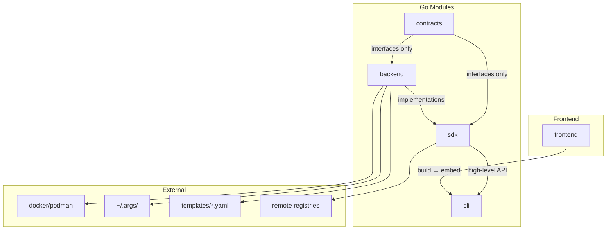
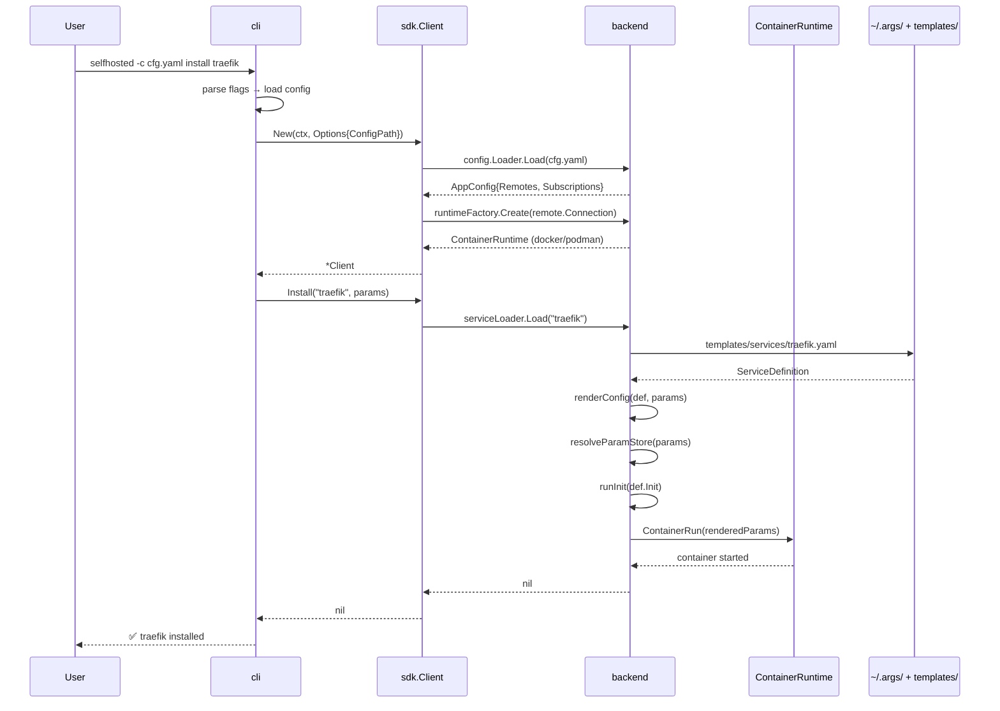
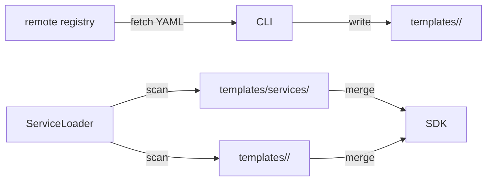

# Architecture

## Module Dependency



## Directory Layout

```
self-hosted-server-traefik/
├── contracts/          # Go module: pure interfaces (no deps)
│   ├── runtime.go      # ContainerRuntime, RuntimeFactory
│   ├── config.go       # ConfigStore, AppConfig, RemoteConfig
│   ├── param.go        # ParamDef, ParamStore, typed params
│   ├── service.go      # ServiceDefinition, ServiceManager
│   ├── template.go     # TemplateEngine, ServiceLoader
│   ├── subscription.go # Subscription, SubscriptionManager
│   └── label.go        # Managed label constants
│
├── backend/            # Go module: implementations
│   ├── adapter/        # Docker / Podman runtime adapters
│   ├── config/         # YAML config file loader
│   ├── store/          # ~/.args/ backed ConfigStore
│   ├── template/       # Go template renderer
│   └── service/        # ServiceManager implementation
│
├── sdk/                # Go module: unified high-level API
│   ├── client.go       # Client struct, New(), lifecycle helpers
│   └── ...
│
├── cli/                # Go module: CLI entry point
│   ├── main.go         # CLI runner with -c/--host flags
│   ├── serve.go        # //go:embed web/dist
│   └── web/dist/       # Built frontend (embedded)
│
├── frontend/           # Vue 3 + Element Plus + Tailwind
│   ├── src/            # Source code
│   ├── e2e/            # Playwright E2E tests
│   └── vite.config.ts  # Build → cli/web/dist/
│
├── templates/          # YAML service definitions
│   └── services/       # ~65 built-in services
│
├── docker/             # Custom Docker image definitions
│   ├── opencode/
│   └── apache-utils/
│
├── build/              # Build & package artifacts
│   └── package/        # Dockerfiles for CLI / backend images
│
├── docs/               # Documentation
├── go.work             # Go workspace
└── Makefile
```

## Data Flow: `selfhosted install traefik`



## Label Convention

All managed containers receive:

| Label | Value |
|---|---|
| `selfhosted.managed` | `true` |
| `selfhosted.service` | `<service-name>` |
| `selfhosted.version` | `<git-sha>` |
| `selfhosted.host` | `<remote-name>` |
| `selfhosted.engine` | `docker` / `podman` |

## Remote Connection

```mermaid
graph LR
    CLI -->|unix://| DOCKER[local Docker]
    CLI -->|tcp://host:2375| REMOTE[remote Docker API]
    CLI -->|ssh://user@host| SSH[SSH tunnel → remote socket]
```

## Subscription Sync


